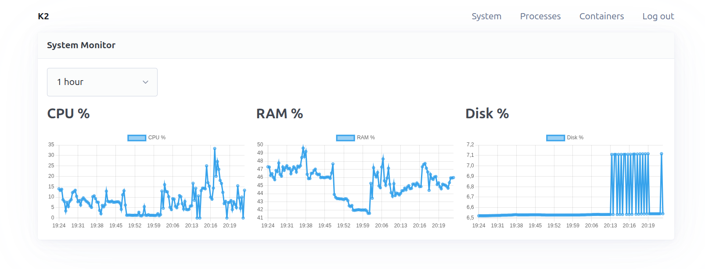
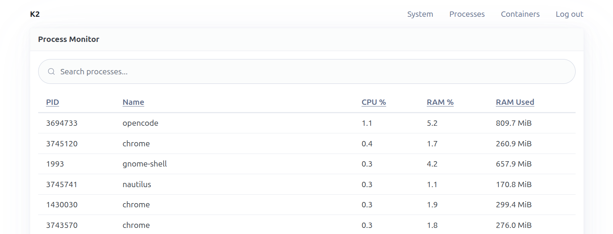
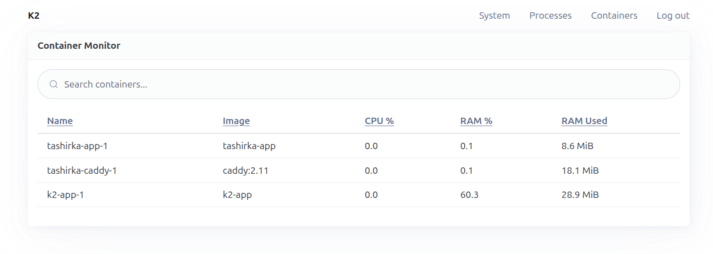

# K2

Server monitoring tool for processes, containers, and system metrics. Built with Go + Echo, htmx + templ + PicoCSS, SQLite.

## Table of Contents

- [Features](#features)
- [Install](#install)
  - [Bare-metal (systemd)](#bare-metal-systemd)
  - [Docker](#docker)
  - [From source (`go install`)](#from-source-go-install)
    - [Run as a systemd service](#run-as-a-systemd-service)
- [Development](#development)
- [Build](#build)
- [Configuration](#configuration)
- [Usage](#usage)
- [Screenshots](#screenshots)
- [Donate](#donate)

## Features

- Real-time metrics for **system** (CPU, memory, disk, network), **processes**, and **containers** (via Docker API)
- Live-updating web UI powered by htmx and Chart.js, with a responsive PicoCSS layout
- SQLite storage with metrics retention and automatic purge
- Admin authentication with login form, session cookies, and account lockout after failed attempts
- One-line **standalone binary** installation (`curl | sudo bash`) with a systemd service
- Runs as a **single static binary without CGO** — no runtime dependencies, works on minimal hardware
- Deployable via bare-metal systemd or Docker Compose

## Install

### Bare-metal (systemd)

```bash
curl -fsSL https://raw.githubusercontent.com/tashirka1/k2/main/scripts/install.sh | sudo bash
```

The script downloads the latest release binary, installs it to `/usr/local/bin/k2`, and sets up a systemd service. Data lives in `/opt/k2`:

> **Note:** the prebuilt binary is available only for **linux-amd64** (Linux x86_64). On other platforms the installer aborts with a warning — build from source or use Docker instead.

- `/opt/k2/k2.env` — environment configuration (generated on first install)
- `/opt/k2/k2.db` — SQLite database

Re-running the script wipes previous data in `/opt/k2` and reinstalls a fresh instance.

### Docker

Clone repository

```bash
cp env-example .env
make up
```

The container runs on port 8000, mapped to the host via `K2_EXTERNAL_PORT` (default `9000`). The `./db/` directory and `.env` are mounted for persistence.

### From source (`go install`)

```bash
go install github.com/tashirka1/k2/cmd/k2@latest
```

Installs the `k2` binary to your `GOBIN` (usually `~/go/bin`). Requires Go and internet access to fetch the latest release.

### Run as a systemd service

Create a config file and the database directory:

```bash
sudo mkdir -p /opt/k2
sudo cp env-example /opt/k2/k2.env
sudoedit /opt/k2/k2.env   # set K2_SESSION_KEY, K2_USERNAME, K2_PASSWORD
```

Create `/etc/systemd/system/k2.service` (replace `ExecStart` with your `GOBIN` path, see `go env GOBIN`):

```ini
[Unit]
Description=K2 server monitoring
After=network.target

[Service]
Type=simple
ExecStart=/home/user/go/bin/k2
WorkingDirectory=/opt/k2
EnvironmentFile=/opt/k2/k2.env
Restart=always
RestartSec=5

[Install]
WantedBy=multi-user.target
```

Start the service:

```bash
sudo systemctl daemon-reload
sudo systemctl enable --now k2
```

## Development

Clone repository

```bash
cp env-example .env
make dev   # run dev server with autoreload (air)
```

## Build

Clone repository

```bash
cp env-example .env
make build-bin          # dev binary to bin/k2
make build-linux-amd64  # static release binary to bin/k2-linux-amd64
make check              # lint + format + tests
```

## Configuration

Create a `.env` file in the project root (see `env-example`):

| Variable               | Default          | Description                              |
| ---------------------- | ---------------- | ---------------------------------------- |
| `K2_SESSION_KEY`       | *(required)*     | Session signing key                      |
| `K2_PORT`              | `8000`           | Server listen port                       |
| `K2_EXTERNAL_PORT`     | `9000`           | Host port for Docker (compose only)      |
| `K2_DB_NAME`           | `./db/k2.db`     | SQLite database path                     |
| `K2_USERNAME`          | —                | Admin username                           |
| `K2_PASSWORD`          | —                | Admin password                           |
| `K2_COLLECT_INTERVAL`  | `30s`            | Metrics collection interval              |
| `K2_RETENTION`         | `168h`           | How long metrics are kept before purging |

## Usage

`k2` — start the server. `k2 credentials` — print the admin username and password.

## Screenshots







## Donate

Support the project on [Boosty](https://boosty.to/tashirka1).
